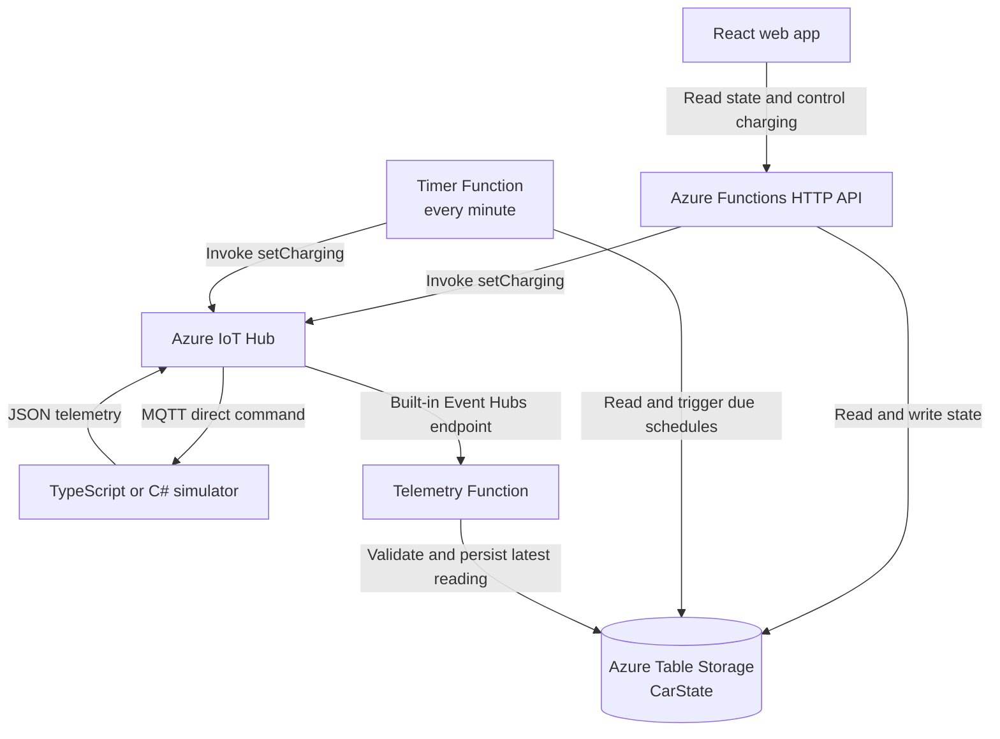

# Car Charging System Demo

An end-to-end Azure IoT Hub demo for monitoring and controlling a simulated electric car. The web app shows the latest battery level and charging state, lets a car owner start or stop charging, and supports an optional daily charging schedule.

Online Dashboard Demo: <https://fn-car-hzy-f2e14596.azurewebsites.net/api/index/>

## What is included

- A React and TypeScript web UI with automatic status refresh, start/stop controls, offline detection, and a local-time charging schedule.
- An Azure Functions API for battery reads, charging commands, schedule management, and telemetry processing.
- A TypeScript simulator and a C# simulator using the Azure IoT Device SDK. Run either one locally to act as the car.
- Azure Table Storage for the latest trusted battery reading and the charging schedule.
- An Azure Functions timer trigger that checks the schedule once per minute.

## Technology

| Area | Technology |
| --- | --- |
| Frontend | React, TypeScript, Vite |
| Backend | Azure Functions, Node.js, TypeScript |
| IoT Device Simulators | TypeScript `azure-iot-device`; C# `Microsoft.Azure.Devices.Client` |
| Device messaging | Azure IoT Hub, MQTT |
| Telemetry processing | IoT Hub built-in Event Hubs-compatible endpoint + Azure Function |
| State storage | Azure Table Storage (`CarState`) |
| Scheduled charging | Azure Functions Timer Trigger |

## Architecture



## Repository layout

```text
web/                React frontend
api/                Azure Functions API
simulator/          TypeScript IoT device simulator
simulator-csharp/   C# IoT device simulator
```

## Prerequisites

- Node.js 22 LTS
- Azure Functions Core Tools v4
- .NET 10 SDK

## Local Test

From the repository root, install dependencies:

```sh
npm run install
```

Build all, then run the tests:

```sh
npm run build
npm run test
```

## Launch IoT Device SDK Simulator

Set the IoT connection string for the registered device before starting a simulator:

```sh
export IOT_DEVICE_CONNECTION='<IoT Hub connection string>'
```

Run exactly **One** simulator at a time:
```sh
# C# simulator
dotnet run --project simulator-csharp

# Or

# TypeScript simulator
npm --prefix simulator start
```
